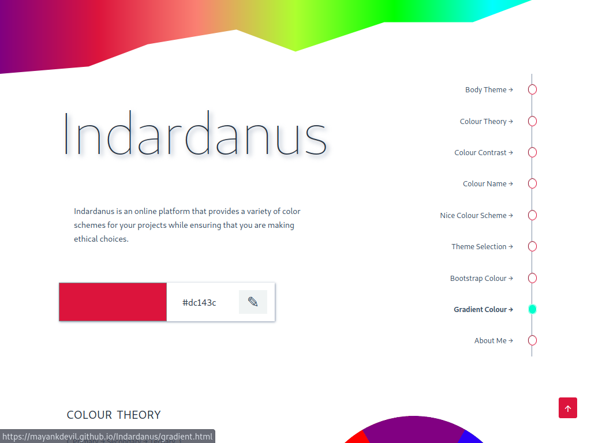

# website-0

- Name : " Indardanus "

- Description : "Discover the perfect color scheme for your Project"

- Version : main

- Update : 29-12-2023

- Status : REST

- TecStack : { HTML | CSS | JavaScript }

- Responsive : True

- Thanks : { VSCodium | GitHub | GIMP }

- Work : Self

- Design : { Mayank }

- Developer : { Mayank }

- CopyRight : { Mayank }

- URL : https://mayankdevil.github.io/Indardanus/

- Clone : https://github.com/MayankDevil/Indardanus.git

- Download : https://github.com/MayankDevil/Indardanus/archive/refs/heads/main.zip

---

#### Home Page

### Responsive

**Breakpoints** { 375 | 576 | 768 | 992 | 1200 }

### Theme Mode

_Switch between dark and light that help to more effective view as day Nidht and Battery Saving._

### Theme

_it theme difficult to set becuse it is colour website but I am make it simple and while theme with multiple colour theme._

### Warning

-- Copyright (c) by Mayank . All Right Reserved --

__" Please refrain from unauthorized coping or downloading of content, as such actions are subject to legal consequences and potential charges.We encourage respectful and responsible use of the resouces provided for learning purpose."__

