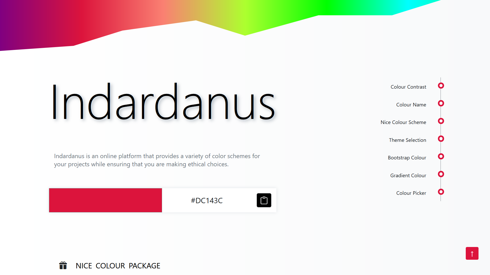

# 🌈 Indardanus  

_Indardanus is a creative platform designed to help you discover, explore, and apply beautiful ethical color schemes that enhance the visual identity of your projects. Whether you are a designer, developer, or a curious creator, Indardanus provides a refined set of palettes and themes that balance aesthetics with functionality. It encourages mindful use of colors, ensuring your projects look vibrant, accessible, and professional._

  

  
  

---

## ⚠️ Legal Notice  

> © 2025 Mayank – **All Rights Reserved**  
>
> 🚫 Unauthorized use, duplication, redistribution, or modification of this project, its content, or design is strictly prohibited.  
>
> 🛑 Any violation will be treated as a **serious legal offense** and may result in civil, financial, or criminal consequences under applicable law.  
>
> ✅ This project is shared for **educational and personal learning purposes only**. Please respect the intellectual property and creativity invested in its development.  

---